Tinner (Anagram of Intern) is a desktop app for managing internship applications for students, optimized for use via a
Command Line Interface (CLI)
while still having the benefits of a Graphical User Interface (GUI). If you can type fast, Tinner allows you to easily
sort through and retrieve relevant information faster than traditional GUI apps.

Tinner aims to solve the hassle of managing internship applications though 3 aspects.

1. **Tracks** essential information such as statuses and deadlines at a glance.
2. **Reminds** you of important deadlines so that you will not miss anything about your application.
3. Allows you to **Review** the process and take down notes so that you can ace your next application.

The main purpose of this User Guide is to assist the user in learning how to use Tinner. The guide covers everything
from what the user sees, how Tinner can help the user, and even its limitations.

# Table of Contents <a id="toc"></a>

* [Quick Start](#quick-start)
* [About](#about)
    * [Outline of this Guide](#outline)
    * [Navigating within Tinner](#navigation)
    * [Technical Terminologies](#technical-terminologies)
    * [General Symbols](#general-symbols)
    * [Command Format](#command-format)
    * [Command Restrictions](#command-restrictions)
        * [Company Restrictions](#c-company-restrictions)
        * [Role Restrictions](#c-role-restrictions)
    * [Demo Use Cases](#demos)
* [Features](#features)
    * [Modifying Companies](#c-modifying-companies)
        * [Adding a company: `addCompany`](#c-add-c)
        * [Editing a company: `editCompany`](#c-edit-c)
        * [Deleting a company: `deleteCompany`](#c-delete-c)
        * [Favouriting a specific company: `favourite`](#c-favourite-c)
        * [Unfavouriting a specific company: `unfavourite`](#c-unfavourite-c)
    * [Modifying Roles](#c-modifying-roles)
        * [Adding a role: `addRole`](#c-add-c-r)
        * [Editing a role: `editRole`](#c-edit-r)
        * [Deleting a role: `deleteRole`](#c-delete-c-r)
    * [Retrieving Companies](#c-retrieving-companies)
        * [Viewing all companies and roles: `list`](#c-list)
        * [Viewing all favourited companies: `listFavourite`](#c-listfavourite)
        * [Finding a specific company or role: `find`](#c-find-c-r)
    * [General](#c-general)
        * [Changing the reminder window: `setWindow`](#c-setWindow-c)
        * [Clearing the company list: `clear`](#c-clear)
        * [Viewing help: `help`](#c-help)
        * [Exiting Tinner: `exit`](#c-exit)
        * [Saving the data](#c-saving-the-data)
* [Frequently Asked Questions (FAQs)](#faq)
* [Command Summary](#command-summary)

--------------------------------------------------------------------------------------------------------------------

# Quick Start <a id="quick-start"></a>

1. Ensure you have Java 11 or above installed in your computer.
2. Download the latest tinner.jar.
3. Copy the file to the folder you want to use as the home folder for your Tinner.

**For Windows**

1. Double-click the file to start the app

**For Mac**

1. Run the following command in the directory containing tinner.jar:

```
java -jar tinner.jar
```

<div markdown="block" class="alert alert-danger">

:warning: On Mac devices, the above command  `java -jar tinner.jar` must be invoked rather than double-clicking the file to start the application or else the application will be unable to run as expected.

</div>


1. Type the command in the command box and press Enter to execute it. e.g. typing help and pressing Enter will open the
   help window.

   Some example commands you can try:
    * **`list`** : Lists all companies and internship roles.
    * **`addCompany`**`n/Google p/98765432 e/hr_google@gmail.com a/70 Pasir Panjang Rd, #03-71 Mapletree Business City II, Singapore 117371` :
      Adds a company named `Google` to Tinner.
    * **`addRole`**`1 n/Software Engineering Intern s/applying r/31-03-2022 23:59 d/Write mobile applications $/5000` :
      Adds a software engineering intern role to the company at index 1.
    * **`deleteCompany`**`1` : Deletes the 1st company shown in the current list.
    * **`deleteRole`**`1 1` : Deletes the 1st role of the 1st company shown in the current list.
    * **`exit`** : Exits the app.

2. Refer to the [Features](#features) below for details of each command.

[Back to Table of Contents](#toc)

--------------------------------------------------------------------------------------------------------------------

# About <a id="about"></a>

## Outline of this Guide <a id="outline"></a>

This subsection helps you to understand the [Graphical User Interface (GUI)](#navigation), commonly
used [technical terminologies](#technical-terminologies) and [general symbols](#general-symbols) to help you better
understand the User Guide.

Following this would be the [Features](#features), detailing the capabilities of Tinner and how to use them. This
section can be either read from the start to bottom or by nicely divided segments of Tinner's repertoire in
the [Table of Contents](#toc) and learn everything you can do with that specific area.

[Back to Table of Contents](#toc)

## Navigating within Tinner <a id="navigation"></a>

The GUI of Tinner can be broken down into different segments with different purposes. This section aims to help users
who are confused by the GUI get a better understanding of its use and get more comfortable using the application.

### Main Window


|      Component      | Function                                                                                                                                                                  |
|:-------------------:|---------------------------------------------------------------------------------------------------------------------------------------------------------------------------|
|       Tab Bar       | Shortcuts for you to quickly exit Tinner or view help                                                                                                                     |
|     Command Box     | Text field for users to key in their commands                                                                                                                             |
|    Response Box     | Tinner's response to user's commands. <br/>If the command was successful, Tinner would respond with what it did. Else it tells you what went wrong and any tips to fix it |
| Company Result List | List out all the companies tracked by Tinner, or those that you specifically want to find                                                                                 |
|  Role Result List   | List out all the roles in this company tracked by Tinner, or those that you specifically want to find                                                                     |
|      Role Tags      | A quick and easy visual aid to check an application's progress, more on this [below](#tags)                                                                               |
|     Status Bar      | Shows the file path to which your data is being saved at                                                                                                                  |

[Back to Table of Contents](#toc)

### Role Tags <a id="tags"></a>

The role tags are colour coded in order to make use of the GUI to better inform you how far along the internship
application process for each role is at a glance.


[Back to Table of Contents](#toc)

### Reminder Pane

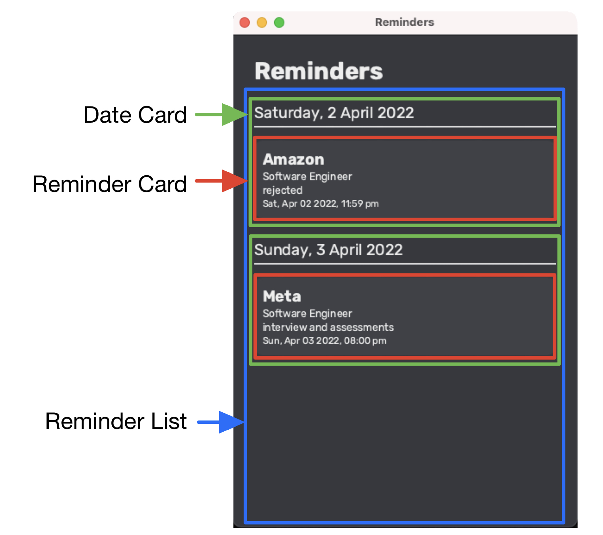

|   Component   | Function                                                                                                             |
|:-------------:|----------------------------------------------------------------------------------------------------------------------|
| Reminder List | List of all reminders within the reminder window (defaults to 7 days) in ascending order                             |
|   Date Card   | With the date denoted at the top, all the reminders within this date card have their date of reminder on the same day |
| Reminder Card | Describes the Company name and Role name to be reminded of as well as its status and full reminder date and time     |

<div markdown="block" class="alert alert-info">

:information_source: The Reminder Pane cannot be re-opened after it is closed, until the next restart of the application.

</div>

<div markdown="block" class="alert alert-info">

:information_source: All changes to Tinner's company list will not be reflected in the Reminder Pane as the application is still running, and will only be reflected after restarting the application.

</div>

[Back to Table of Contents](#toc)

## Technical Terminologies <a id="technical-terminologies"></a>

| Term |  What it means |
|:----------:|-------------|
| Command word| Commands are invoked based on the command word, which is the first word in every user command. The command word is indicated by `COMMAND_WORD` in the guide.|
|Parameter|User input supplied to a command|

[Back to Table of Contents](#toc)

## General Symbols <a id="general-symbols"></a>

| Symbol |  What it means |
|:----------:|-------------|
| `list` |  Words that have a grey highlighted background are either commands or parameters. |
|:bulb:|Useful tip|
|:warning:|Warning|
|:information_source:|Important piece of information |

[Back to Table of Contents](#toc)

## Command Format <a id="command-format"></a>

The following points explain the format of a command.

* Words in `UPPER_CASE` are the parameters to be supplied by the user.<br>
  e.g. in `addCompany n/COMPANY e/EMAIL`, `COMPANY` and `EMAIL` represent parameters which can be used like `addCompany n/Google e/hr@google.com`.

* Items in square brackets are optional.<br>
  e.g `n/COMPANY [p/PHONE_NUMBER]` can be used as `n/Google P/65427981` or as `n/Google`.

* Parameters can be in any order.<br>
  e.g. if the command specifies `n/COMPANY [p/PHONE_NUMBER]`, `[p/PHONE_NUMBER] n/COMPANY` is also acceptable.

* If a parameter is expected only once in the command but you specified it multiple times, only the last occurrence of
  the parameter will be taken.<br>
  e.g. if you specify `p/12341234 p/56785678`, only `p/56785678` will be taken.

* Additional parameters for commands that do not take in parameters (such as `help`, `list`, `exit`) will be
  ignored.<br>
  e.g. if the command specifies `help 123`, it will be interpreted as `help`.

* Duplicate company names are not allowed.<br>
  e.g. if there exists a company named `meta`, adding another company with the name `meta` is not allowed.

<div markdown="block" class="alert alert-info">

:information_source: Commands are recognised by their command word. As such, if the command word is incorrect, even if it differs slightly from the correct command word, Tinner's response box will indicate that you have entered an unknown command.

</div>

<div markdown="block" class="alert alert-info">

:information_source: Note that the invalid command messages in the response box will not specify the missing parameters in the command.

</div>

[Back to Table of Contents](#toc)

## Command Restrictions <a id="command-restrictions"></a>

### Company Restrictions <a id="c-company-restrictions"></a>

* The `COMPANY_NAME` should only contain alphanumeric characters and spaces, but not blank, and have a character limit of at most 30.
* The `PHONE_NUMBER` should only contain numbers, and be at least 3 digits long and at most 14 digits.
* The `EMAIL` should be of the format local-part@domain and adhere to the following constraints:
    * The local-part should only contain alphanumeric characters and these special characters, excluding the
      parentheses, (+_.-).
    * The local-part may not start or end with any special characters.
    * This is followed by a '@' and then a domain name. The domain name is made up of domain labels separated by
      periods.
    * The domain name must:
        * end with a domain label at least 2 characters long
        * have each domain label start and end with alphanumeric characters
        * have each domain label consist of alphanumeric characters, separated only by hyphens, if any
* The `ADDRESS` should not be blank. 

<div markdown="block" class="alert alert-info">

:information_source: In the `ADDRESS` field, if the character / is present, the previous character in the user input should be a space to observe the intended output. If the previous character matches any of these characters, (aenp), excluding the parentheses, the intended output will not be observed.

</div>

[Back to Table of Contents](#toc)

### Role Restrictions <a id="c-role-restrictions"></a>

* The `ROLE_NAME` should only contain alphanumeric characters, spaces and an optional pair of round brackets, but not blank, and have a character limit of at most 30.
* The `REMINDER_DATE` should not be in the past and must be a valid date 
in the following format: dd-MM-yyyy HH:mm.
* The `STATUS` is case-sensitive and can only accept the following inputs:
    * applying
    * pending
    * interview and assessments
    * offered
    * rejected
    * complete
* The `DESCRIPTION` can contain alphanumeric characters, spaces and special characters.
* The `STIPEND` must be a positive integer going up to 10 digits long.

<div markdown="block" class="alert alert-info">

:information_source: An integer is a number which is not a fraction; a whole number.

</div>

[Back to Table of Contents](#toc)

--------------------------------------------------------------------------------------------------------------------

# Demo Use Cases <a id="demos"></a>

## Use Case #1: Applying to a role in a company <a id="usecase1"></a>

Say you found a company with an opening that you are interested in. You did your research and found relevant information
pertaining to the company and the role. Here's how you can input this data in the application:

1. [Add the company](#c-add-c) to the company list.
   

2. [Add the role](#c-add-c-r) under the added company.
   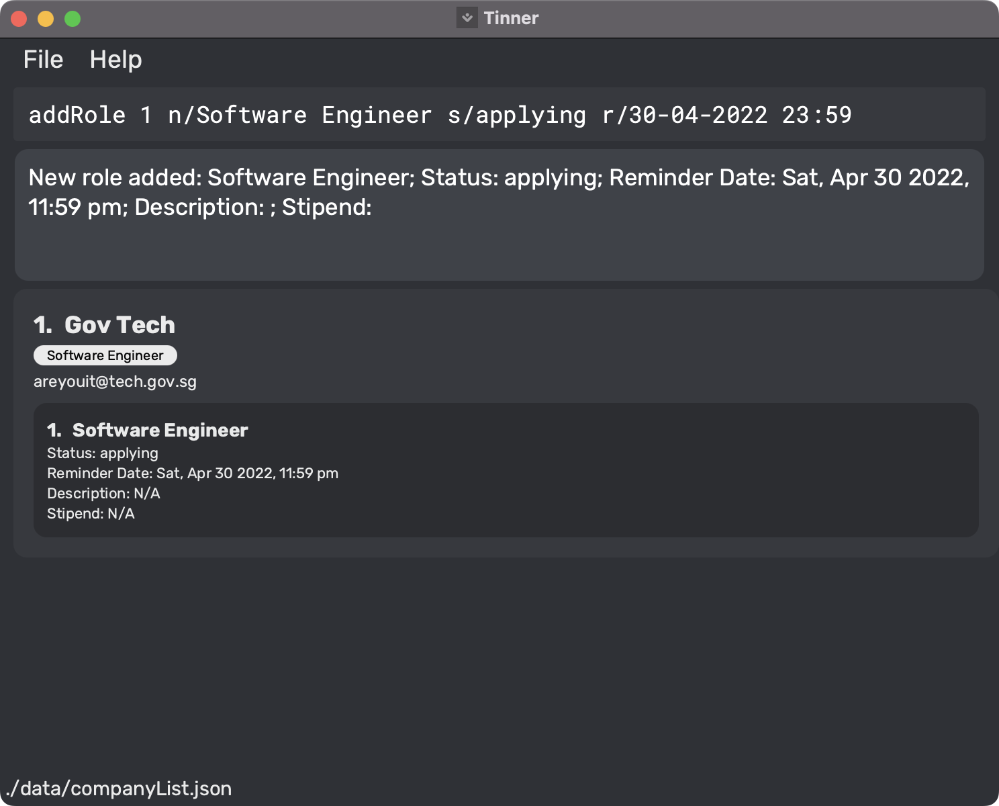

<div markdown="block" class="alert alert-info">

:information_source: Note the successful command execution message in the response box upon successful adding of
the role. This applies for this use case and all other use cases listed.

</div>

[Back to Table of Contents](#toc)

## Use Case #2: Deleting a company or a role <a id="usecase2"></a>

Perhaps for some reason, you decide not to go through with an application. Maybe you realised the company's mission and
vision were not in line with your values or maybe you realised the role isn't for you. Here's how you can delete these
entries from the application:

1. [Delete the role](#c-delete-c-r) from a given company.
   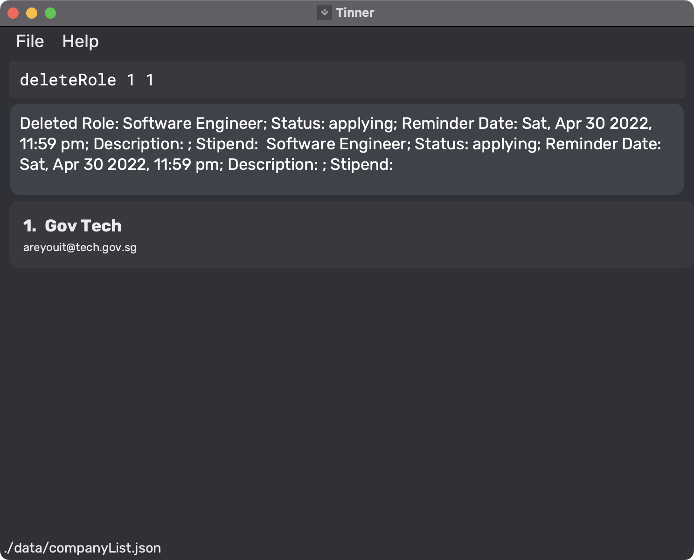

2. [Delete the company](#c-delete-c) from the company list.
   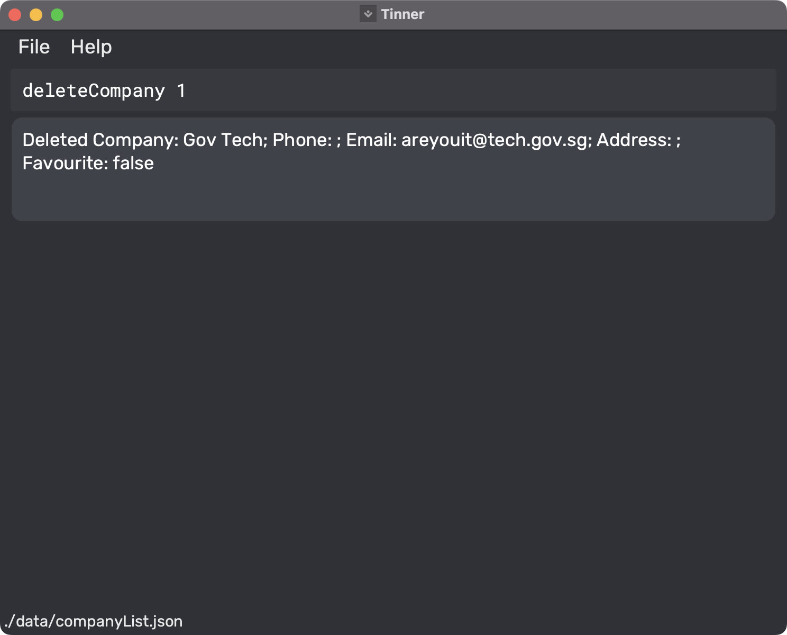

## Use Case #3: Editing a company or a role <a id="usecase3"></a>

Say you received an email for an interview and the point of contact's email is different. Here's how you can make
changes to the application:

1. [Edit the company](#c-edit-c) from the company list.  
   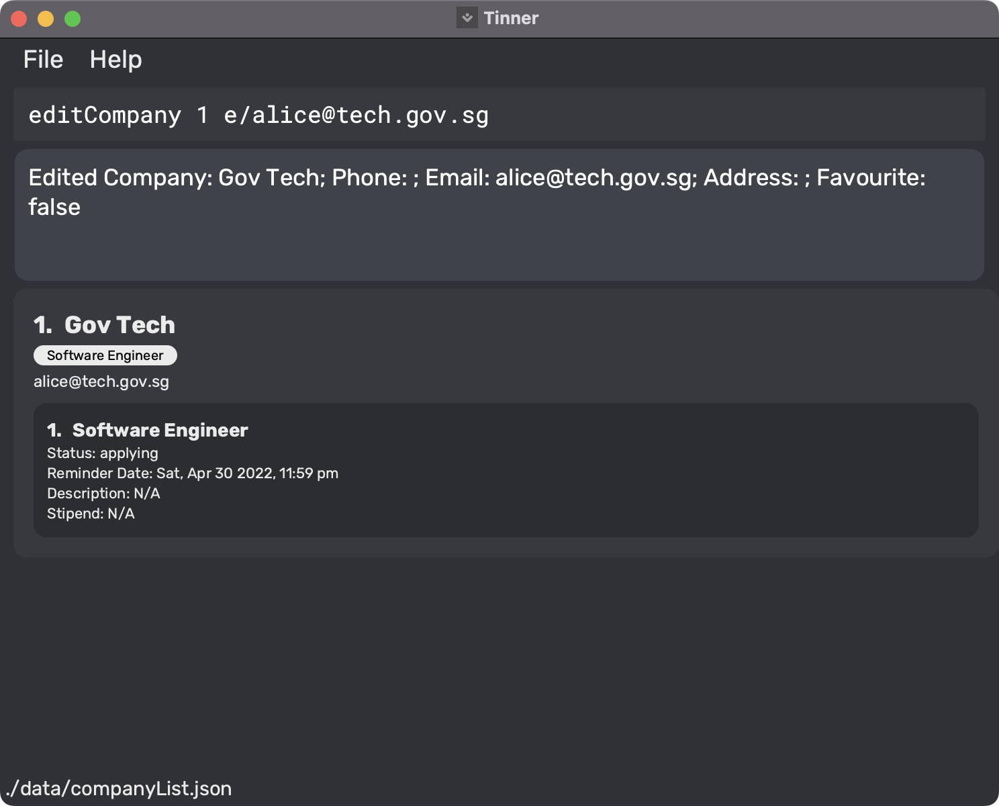

Also, you can change the status of your internship application and set the reminder for the interview date by making
this entry:

2. [Edit the role](#c-edit-r) from a given company.  
   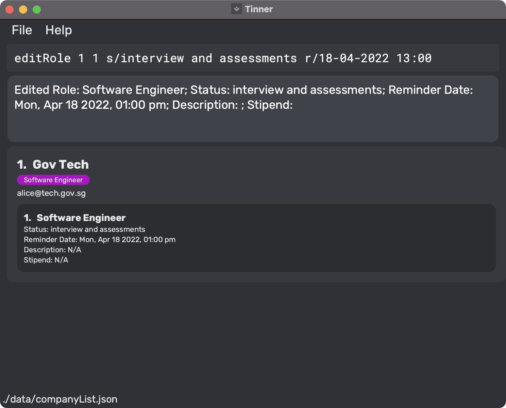

<div markdown="block" class="alert alert-info">

:information_source: Note the change in color of the [role tag](#tags).

</div>

## Use Case #4: Setting reminder window for reminder list <a id="usecase4"></a>

Assuming that the reminder date from [USE_CASE_3](#usecase3) is within a week from today, upon the next opening of
Tinner, you will be able to see a reminder pop-out box like this:   
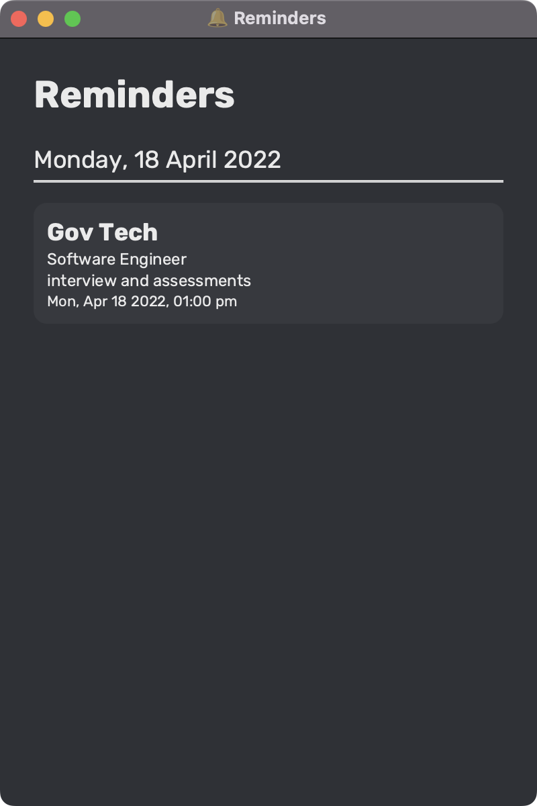

If you do not see the intended reminder, it is likely that the reminder date is not within
the [reminder window](#c-setWindow-c).  
Thus, you can increase the reminder window by making this entry:

1. [Set the reminder window](#c-setWindow-c) for the reminder list.  
   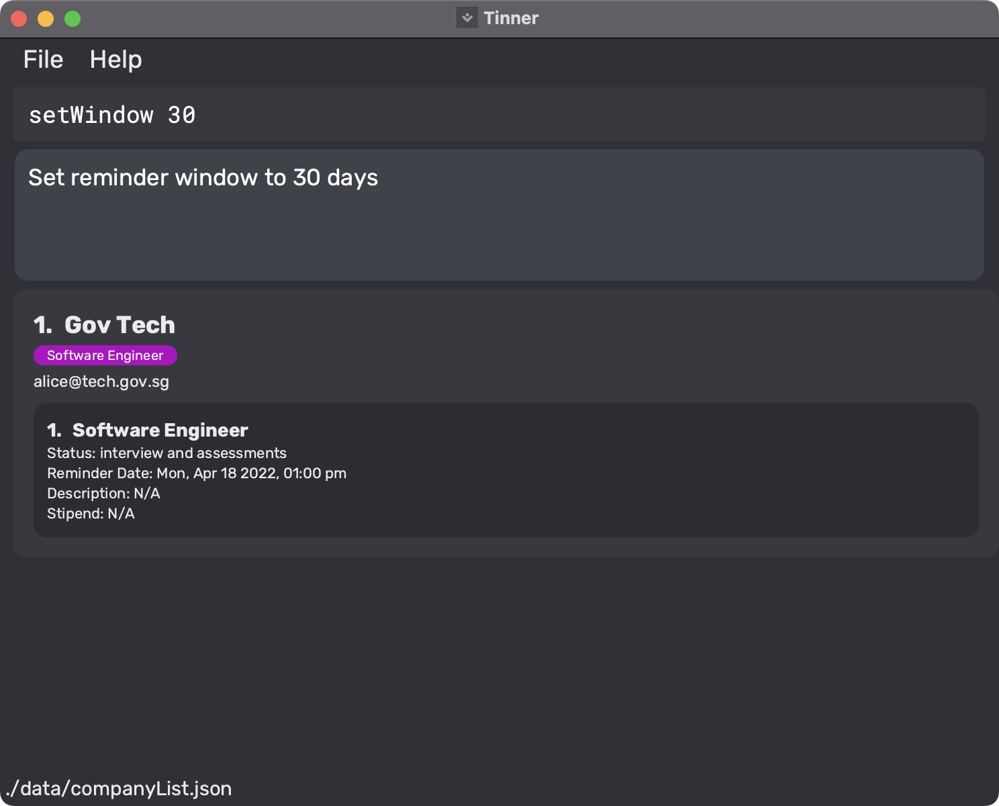

## Use Case #5: Favouriting a company <a id="usecase5"></a>

A scenario where multiple companies have sent you offers and you may want to store these companies in
a [list of favourites](#c-listfavourite) for ease of reference.  
You can favourite a company by making this entry:

1. [Favourite a company](#c-favourite-c) from the company list.  
   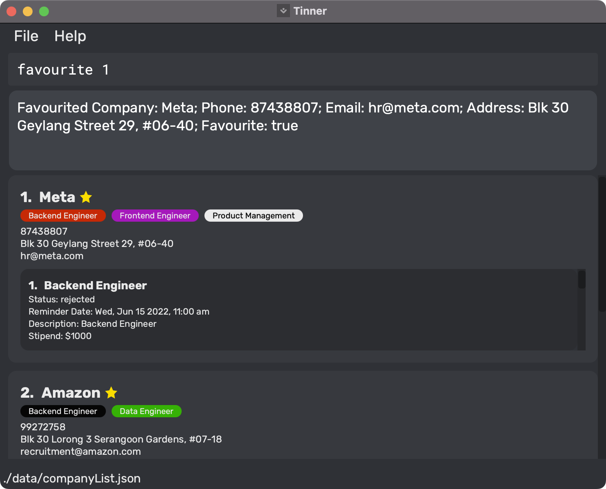
   

<div markdown="block" class="alert alert-info">

:information_source: Note that the favourite company will be denoted by the star icon next to the company name.

</div>

<div markdown="block" class="alert alert-info">

:information_source: Note that favouriting companies can be utilized in other ways, and not just to keep track of
companies which have sent you offers.

</div>

You can choose to unfavourite by making this entry:

2. [Unfavourite a company](#c-favourite-c) from the company list.  
   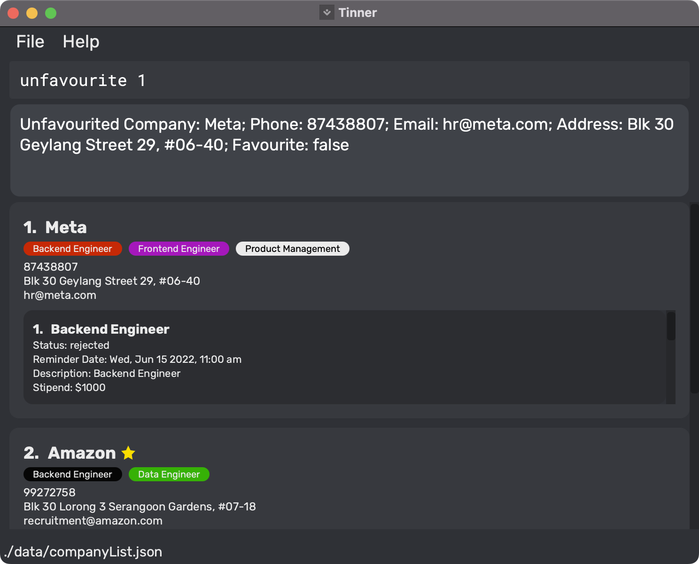

Finally, you can make a quick reference by listing all favourite companies using the [listFavourite](#c-listfavourite)
command.

## Use Case #6: Finding a company and/or role <a id="usecase6"></a>
In the future when you have many applications, finding specific applications can be daunting. The
[find command](#c-find-c-r) allows you to search for applications easily with keywords matching `COMPANY_NAME` and `ROLE_NAME`.

Say you are interested in finding out what are the roles you had applied to at Google,
you can make this entry:
1. [Finding a company](#c-find-c-r) from the company list.
   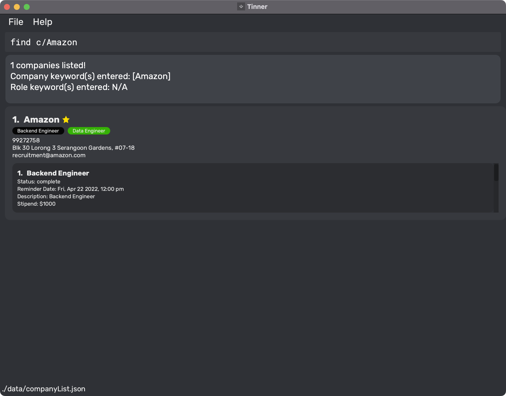

Then after realising that you have an interview for a backend role at Google, you want to check out the progress of similar roles.
You can search for other backend roles by making this entry:
2. [Finding all roles](#c-find-c-r) from the company list.
   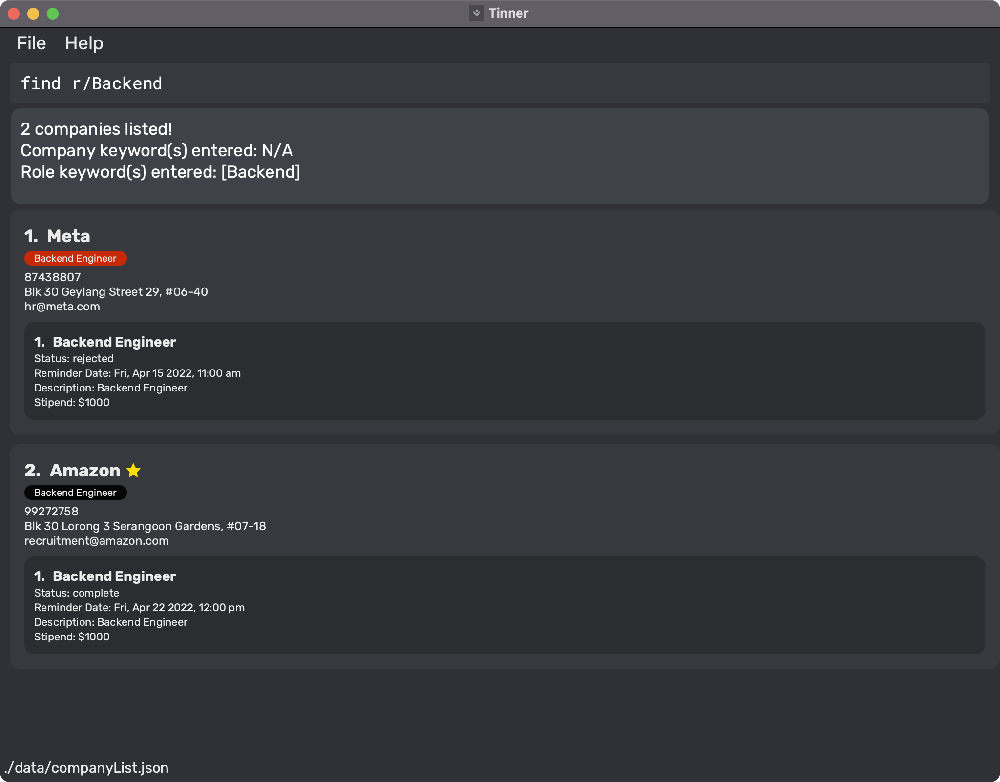

<div markdown="span" class="alert alert-primary">

:bulb: Find a specific role in a specific company by providing both `COMPANY_NAME` and `ROLE_NAME`. E.g. `find c/google r/backend engineer`.

</div>

<div markdown="span" class="alert alert-primary">

:bulb: After performing the find command, the response box will contain role and company keywords which you have previously entered.

</div>

[Back to Table of Contents](#toc)

--------------------------------------------------------------------------------------------------------------------

# Features <a id="features"></a>

## Modifying Companies <a id="c-modifying-companies"></a>

This section pertains to modifying the data of a company item as stored by Tinner.

### Adding a company: `addCompany` <a id="c-add-c"></a>

The most fundamental command in Tinner. Much like storing contact details in an address book, save details about a
company that may come in handy during the internship application process.

**Function:** Adds a company that does not exist in the list.

**Format:** `addCompany n/COMPANY_NAME [p/PHONE_NUMBER] [e/EMAIL] [a/ADDRESS]`

* More restrictions for command parameters can be found [here](#c-company-restrictions)

**Examples:**

* `addCompany n/Google p/98765432 e/hr_google@gmail.com a/70 Pasir Panjang Rd, #03-71 Mapletree Business City II, Singapore 117371 `
* `addCompany n/Meta p/91234567 e/hr_meta@meta.com a/9 Straits View, Marina One, Singapore 018937`
* Refer to [Demo Use Case #1](#usecase1) for an example use case.

<div markdown="block" class="alert alert-info">

:information_source: The `EMAIL` and `PHONE_NUMBER` are fields to store the contact details belonging to the Point of Contact (POC) after applying for a role at the company. This POC could be a representative from a job seeking agency.

</div>

<div markdown="block" class="alert alert-danger">
:warning: If a prefix is specified, even for optional fields, the value after the prefix cannot be blank. e.g. `p/` only is not valid but `p/94442222` is valid.  
</div>


[Back to Table of Contents](#toc)

### Editing an existing company in the company list : `editCompany` <a id="c-edit-c"></a>

Added a company with `addCompany` but made a typo? The company recruitment team changed their email address? Fret
not, `editCompany` has got you covered. Simply edit the parts of the company details that you want updated.

**Function:** Edits the specified company within the displayed company list.

**Format:** `editCompany COMPANY_INDEX [n/COMPANY_NAME] [p/PHONE_NUMBER] [e/EMAIL] [a/ADDRESS]`

* Edits the company at the specified INDEX. The index refers to the index number shown in the displayed company list.
  The index must be a positive integer 1, 2, 3, …​
* At least one of the optional fields must be provided.
* Existing values will be updated to the input values.
* The `PHONE_NUMBER`, `EMAIL` and `ADDRESS` here can be left blank, allowing you to remove previously added information which may be erroneous.
* More restrictions for command parameters can be found [here](#c-company-restrictions)

**Examples:**

* `list` followed by `editCompany 1 p/91234567 e/johndoe@example.com` edits the 1<sup>st</sup> company in the displayed company list.
* `list` followed by `editCompany 1 p/ e/` removes `PHONE_NUMBER` and `EMAIL` from the 1<sup>st</sup> company in the displayed company list.
* Refer to [Demo Use Case #3](#usecase3) for an example use case.

[Back to Table of Contents](#toc)

### Deleting a Company : `deleteCompany` <a id="c-delete-c"></a>

Delete a company when you're not interested in them anymore with `deleteCompany`. This will help you keep your list of
companies less clustered and thus more organised.

**Function:** Deletes the specified company within the displayed company list.

**Format:** `deleteCompany COMPANY_INDEX`

* Deletes the company at the specified `COMPANY_INDEX`.
* The index refers to the index number shown in the displayed company list.
* The index must be a positive integer like 1, 2, 3, …
* Refer to [Demo Use Case #2](#usecase2) for an example use case.

**Examples:**

* `list` followed by `deleteCompany 2` deletes the 2<sup>nd</sup> company in the displayed company list.

<div markdown="block" class="alert alert-danger">

:warning: Deleting a company would also delete all roles and information belonging to it. Since there is no undo feature, please double check before using this command.

</div>

[Back to Table of Contents](#toc)

### Favouriting a specific company: `favourite` <a id="c-favourite-c"></a>

We all have those few companies that we're particularly interested in. Use `favourite` to visually tag a company with a
star to let it stand out from the rest.

**Function:** Favourite a specific company from the list of companies.

**Format:** `favourite COMPANY_INDEX`

* Favourites the company at the specified `COMPANY_INDEX`.
* The index refers to the index number shown in the displayed company list.
* The indexes must be a positive integer like 1, 2, 3, …

**Examples:**

* `list` followed by, `favourite 1` favourites the 1<sup>st</sup>
  company in Tinner.
* Refer to [Demo Use Case #5](#usecase5) for an example use case.

<div markdown="span" class="alert alert-primary">

:bulb: Easily track and view your favourite companies by using the [`listFavourite`](#c-listfavourite) command

</div>

[Back to Table of Contents](#toc)

### Unfavouriting a specific company: `unfavourite` <a id="c-unfavourite-c"></a>

Perhaps you fell through with an ex-favourite company. Use `unfavourite` to peel that star off.

**Function:** Unfavourite a specific company from the list of companies.

**Format:** `unfavourite COMPANY_INDEX`

* Unfavourites the company at the specified `COMPANY_INDEX`.
* The index refer to the index number shown in the displayed company list.
* The indexes must be a positive integer like 1, 2, 3, …

**Examples:**

* `list` followed by, `unfavourite 1` unfavourites the 1<sup>st</sup>
  company in Tinner.
* Refer to [Demo Use Case #5](#usecase5) for an example use case.

[Back to Table of Contents](#toc)

## Modifying Roles <a id="c-modifying-roles"></a>

This section discusses features that modify the data of a role item that is (or is to be) associated with a company in
Tinner.

### Adding an internship role to an existing company: `addRole` <a id="c-add-c-r"></a>

What's Tinner without the ability to track internships? Use `addRole` create a new internship role under an existing
company.

**Function:** Adds an internship role to a company that already exists in the list.

**Format:** `addRole COMPANY_INDEX n/ROLE_NAME [(TYPE)] s/STATUS [r/REMINDER_DATE] [d/DESCRIPTION] [$/STIPEND]`

* Add internship role at the specified `COMPANY_INDEX`.
* The `COMPANY_INDEX` must be a positive integer like 1, 2, 3, …
* More restrictions for command parameters can be found [here](#c-role-restrictions)

**Examples:**

* `addRole 1 n/Data Analyst s/applying r/31-03-2022 23:59 d/Analyse data $/4800 `
* `addRole 3 n/Software Engineer (Front end) s/applying r/30-04-2022 01:20 d/web deveploment with react js $/2400 `
* `list` followed by `deleteCompany 2` deletes the 2<sup>nd</sup> company in the displayed company list.
* Refer to [Demo Use Case #1](#usecase1) for an example use case.

<div markdown="span" class="alert alert-primary">

:bulb: If there are too many companies and you do not know what is the company index, try [searching for keywords](#c-find-c-r) to that company and use the new index shown instead.

</div>

<div markdown="block" class="alert alert-info">

:information_source: Role name is special as it does not just accept alphanumeric symbols, but also round brackets too.

</div>

<div markdown="block" class="alert alert-info">
   
:information_source: Roles in a Company are listed based on the order in which they are added to the Company.
   
</div>

<div markdown="block" class="alert alert-danger">

:warning: When round brackets are used, they must be in pairs.

</div>

<div markdown="block" class="alert alert-danger">

:warning: If a prefix is specified, even for optional fields, the value after the prefix cannot be blank. e.g. `$/` only is not valid but `$/1000` is valid.

</div>


[Back to Table of Contents](#toc)


### Editing an existing role from company : `editRole` <a id="c-edit-r"></a>

Just got invited to an interview? Keep your internship role status and other details up to date with `editRole`.

**Function:** Edits the specified role in the specified company within the displayed company list.

**Format:** `editRole COMPANY_INDEX ROLE_INDEX [n/ROLE_NAME [(TYPE)]] [s/STATUS] [r/REMINDER_DATE] [d/DESCRIPTION] [$/STIPEND]`

* Edits the role at the specified `ROLE_INDEX` of the company at the specified `COMPANY_INDEX`. The indexes refers to
  the index number shown in the displayed company list. The indexes must be a positive integer 1, 2, 3, …​
* At least one of the optional fields must be provided.
* Existing values will be updated to the input values.
* The `REMINDER_DATE`, `DESCRIPTION` and `STIPEND` here can be left blank, allowing you to remove previously added information which may be erroneous.
* More restrictions for command parameters can be found [here](#c-role-restrictions)

**Examples:**

* `list` followed by `editRole 1 1 s/offered $/3000` edits the 1<sup>st</sup> role from the 1<sup>st</sup> company
  in the displayed company list.
* `list` followed by `editRole 1 1 r/ d/ $/` removes `REMINDER_DATE`, `DESCRIPTION` and `STIPEND` from the 1<sup>st</sup> role from the 1<sup>st</sup> company
  in the displayed company list.
* Refer to [Demo Use Case #3](#usecase3) for an example use case.

[Back to Table of Contents](#toc)

### Deleting an internship role from company : `deleteRole` <a id="c-delete-c-r"></a>

Perhaps you revoked an internship application, or never got word back from a company. Whatever your reason, keep
reundant roles off your mind and Tinner with `deleteRole`.

**Function:** Deletes the specified role in the specified company within the displayed company list.

**Format:** `deleteRole COMPANY_INDEX ROLE_INDEX`

* Deletes the role at the specified `ROLE_INDEX` of the company at the specified `COMPANY_INDEX`. The indexes refer to
  the index numbers shown in the displayed company list.
* The indexes must be a positive integer like 1, 2, 3, …

**Examples:**

* `list` followed by, `deleteRole 1 1` deletes the 1<sup>st</sup> role from the 1<sup>st</sup>
  company in the displayed company list.
* Refer to [Demo Use Case #2](#usecase2) for an example use case.

[Back to Table of Contents](#toc)

## Retrieving Companies <a id="c-retrieving-companies"></a>

Refer to this section for features that retrieve the data of company items.

### Listing all companies : `list` <a id="c-list"></a>

After adding the companies and internship roles, view them all at a glance with `list`.

**Function:** Shows a list of all companies and internship roles in Tinner.

**Format:** `list`

[Back to Table of Contents](#toc)

### Listing all favourited companies : `listFavourite` <a id="c-listfavourite"></a>

Keep your priorities straight with `listFavourite`. It's `list` but for your `favourite` companies!

**Function:** Shows a list of all favourited companies and internship roles within these companies in Tinner.

**Format:** `listFavourite`

**Examples:**

* Refer to [Demo Use Case #5](#usecase5) for an example use case.

[Back to Table of Contents](#toc)

### Finding companies or internship roles by name: `find` <a id="c-find-c-r"></a>

If you're having trouble locating a specific company or internship role, consider `find`. Save time by using keywords to
readily identify and track down items!

**Function:** Find companies or/and roles depending on the format given.

* If only company keywords are entered, companies whose names match any of the given keywords will be displayed with all
  their roles.
* If only role keywords are entered, roles across all companies whose role names match any of the given keywords will be
  displayed.
* If both keywords are entered, only companies whose names match any of the company keywords, while containing one or
  more roles whose names match any of the role keywords, are displayed.

**Format:** `find c/COMPANY_KEYWORD [MORE_COMPANY_KEYWORDS] r/ROLE_KEYWORD [MORE_ROLE_KEYWORDS]`

* The search is case-insensitive. e.g. `meta` will match `Meta`.
* The order of the keywords does not matter. e.g. `software engineer` will match `engineer software`.
* Only the company name, and the role name are searched.
* Only full words would be matched e.g. `mobile` will not match `mobiles`
* Companies and roles matching at least one keyword will be returned e.g. `software engineer` will
  match `mobile engineer` and `software developer`
* At least one role keyword or one company keyword must be provided in the user input.
* The prefixes `c/` and `r/` can be omitted or included if no corresponding keywords are meant to be entered

**Examples:**

* `find c/meta amazon r/engineer`
* Refer to [Demo Use Case #6](#usecase6) for an example use case.

<div markdown="block" class="alert alert-info">

:information_source: Note that if you are trying to find 'book' within company names, Tinner would return records named Face Book but not Facebook.

</div>

[Back to Table of Contents](#toc)

## General <a id="c-general"></a>

Below are miscellaneous features that enhance the general user experience.

### Clearing the company list: `clear` <a id="c-clear"></a>

Start off the internship application period fresh with `clear`. Reset the list of companies and internship roles with a
single command.

**Function:** Clears the entire company list, including roles within each company.

**Format:** `clear`

[Back to Table of Contents](#toc)

### Viewing help : `help` <a id="c-help"></a>

If you're not too familiar with the CLI, `help` can help! It'll bring you right here to assist you.

**Function:** Shows a message explaining how to access the User Guide.


**Format:** `help`

[Back to Table of Contents](#toc)

### Changing the reminder window: `setWindow` <a id="c-setWindow-c"></a>

Is the default reminder window of 7 days not to your liking? Update the window size with `setWindow` so that you can
keep better track of upcoming tasks.

* The parameter `REMINDER_WINDOW` specifies the period (in days) in which you will receive reminders before a role's
  reminder date.
* Sets the reminder window to the specified `REMINDER_WINDOW`.
* The `REMINDER_WINDOW` is capped at 30 (in days) because Tinner aims to highlight only imminent deadlines.
* All roles with reminder dates that are within the specified `REMINDER_WINDOW` days away from today will show up in the
  reminders window.

**Format:** `setWindow REMINDER_WINDOW`

**Examples:**

* `setWindow 14` would make Tinner remind you of all upcoming reminders from up to two weeks prior to the associated
  role's reminder date.
* Refer to [Demo Use Case #4](#usecase4) for an example use case.

<div markdown="block" class="alert alert-info">

:information_source: Changes to the reminder window can only be observed after restarting Tinner. 

</div>

[Back to Table of Contents](#toc)

### Exiting the program : `exit` <a id="c-exit"></a>

Use `exit` if you're too lazy to click out of the application.

**Function:** Exits the Tinner application.

**Format:** `exit`

[Back to Table of Contents](#toc)

### Saving the data <a id="c-saving-the-data"></a>

Tinner data are saved in the hard disk automatically after any command that changes the data. There is no need to save
manually.

[Back to Table of Contents](#toc)

--------------------------------------------------------------------------------------------------------------------

# Frequently Asked Questions (FAQs) <a id="faq"></a>

**Q**: Do I need to save my data manually?<br>
**A**: No, you don't. Your list of companies is saved automatically after each user command.

**Q**: Why is there already data in Tinner when I first launch the application?<br>
**A**: When you use Tinner for the first time, Tinner creates a list of companies with sample data containing a set of
default companies and roles. You may use the command `clear` if you wish to erase all the sample data.

**Q**: Where is my data saved?<br>
**A**: When you use Tinner for the first time, a folder named data is created in the application's home directory
containing a file named "companyList.json". The list of companies is stored within this file.

**Q**: How do I transfer my data to another computer?<br>
**A**: Install the app in the other computer. Overwrite the empty data file it creates with the data file from your
previous Tinner home folder.

**Q**: What happens if I clear the company list accidentally using `clear`<br>
**A**: Please ensure that you only use the command `clear` when you are certain that you want to erase the company list.
There are currently no features to revert the `clear` command.

[Back to Table of Contents](#toc)

--------------------------------------------------------------------------------------------------------------------

# Command Summary <a id="command-summary"></a>

| Action                        | Format, Examples                                                                                                                                                                                                   |
|-------------------------------|--------------------------------------------------------------------------------------------------------------------------------------------------------------------------------------------------------------------|
| **Add company**               | `addCompany n/COMPANY_NAME [p/PHONE_NUMBER] [e/EMAIL] [a/ADDRESS]` <br><br> e.g., `addCompany n/Google p/98765432 e/hr_google@gmail.com a/70 Pasir Panjang Rd, #03-71 Mapletree Business City II, Singapore 117371`|
| **Edit company**              | `editCompany COMPANY_INDEX [p/PHONE_NUMBER] [e/EMAIL] [a/ADDRESS]` <br><br> e.g., `editCompany 1 n/Google p/98765432 e/hr_google@gmail.com`                                                                        |
| **Delete company**            | `deleteCompany COMPANY_INDEX `<br><br> e.g., `deleteCompany 3 `                                                                                                                                                    |
| **Favourite company**         | `favourite COMPANY_INDEX` <br><br> e.g., `favourite 1`                                                                                                                                                             |
| **Unfavourite company**       | `unfavourite COMPANY_INDEX` <br><br> e.g., `unfavourite 1`                                                                                                                                                         |
| **Add role**                  | `addRole COMPANY_INDEX n/ROLE_NAME [(TYPE)] s/STATUS b/DEADLINE [d/DESCRIPTION] [$/STIPEND]` <br><br> e.g., `addRole 1 n/Data Analyst s/applying b/31-03-2022 23:59 d/Analyse marketing data $/5000`               |
| **Edit role**                 | `editRole COMPANY_INDEX ROLE_INDEX [n/ROLE_NAME [(TYPE)]] [s/STATUS] [b/DEADLINE] [d/DESCRIPTION] [$/STIPEND]` <br><br> e.g., `editRole 1 1 s/pending b/31-03-2022 23:59 $/5000`                                   |
| **Delete role**               | `deleteRole COMPANY_INDEX ROLE_INDEX` <br><br> e.g., `deleteRole 3 1 `                                                                                                                                             |
| **List companies**            | `list`                                                                                                                                                                                                             |
| **List favourited companies** | `listFavourite`                                                                                                                                                                                                    |
| **Find company or role**      | `find c/COMPANY_KEYWORD [MORE_COMPANY_KEYWORDS] r/ROLE_KEYWORD [MORE_ROLE_KEYWORDS]` <br><br> e.g., `find c/google r/mobile software`                                                                              |
| **Set reminder window**       | `setWindow REMINDER_WINDOW` <br><br> e.g., `setWindow 14`                                                                                                                                                          |
| **Clear**                     | `clear`                                                                                                                                                                                                            |
| **Help**                      | `help`                                                                                                                                                                                                             |
| **Exit Tinner**               | `exit`                                                                                                                                                                                                             |

[Back to Table of Contents](#toc)
